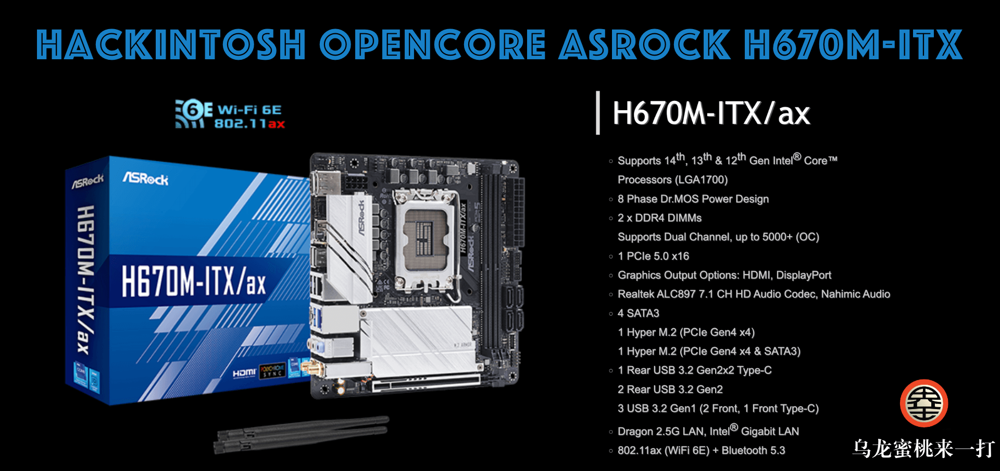

## ASRock H670M-ITX/ax Hackintosh OpenCore EFI



### [简体中文](README.zh_CN.md)

### OpenCore

[OpenCore 1.0.0](https://github.com/acidanthera/OpenCorePkg)

### OS Version Tested

- macOS Monterey 12.x
- macOS Ventura  13.x
- macOS Sonoma   14.x 

### Hardware

- Motherboard: ASRock H670M-ITX/ax
- Bios Version:13.01（2023/04/13）
- CPU: Intel i5-12600kf
- RAM: Asgard 16GB*2 DDR4 3000MHz
- SSD: 1.WD SN730 476G MacOS
- SSD: 2.SK hynix PC401 238G Windows
- GPU: Sapphire Radeon RX560 4GB 896SP
- Audio: Realtek ALC897
- Ethernet Card: Intel L219-V
- Ethernet Card: Realtek RTL8125 Gaming 2.5GbE
- WiFi Card: DW1560

### Notes

 - Use [OCAuxiliaryTools](https://github.com/ic005k/OCAuxiliaryTools) build your SMBIOS

 - If you want to use a CPU without Efficient-Core, you must uncheck the option in the config.plist file Kernel--ProvideCurrentCpuinfo

### Bios Setup

```

   |-- cfg Lock ：Disabled
	 |-- Intel Virtualization Technology ：Enabled
	 |-- XHCI Hand-off ：Enabled
	 |-- Above 4G Decoding ：Enabled
	 |-- VT-D ：Enabled
	 |-- C.A.M. (Clever Access Memory) ：Disabled
	 |-- Secure Boot ：Disabled
	 |-- Fast Boot ：Disabled
	 |-- Launch CSM  ：Disabled
```


### Contact Us

 - QQ Group: 23304408

