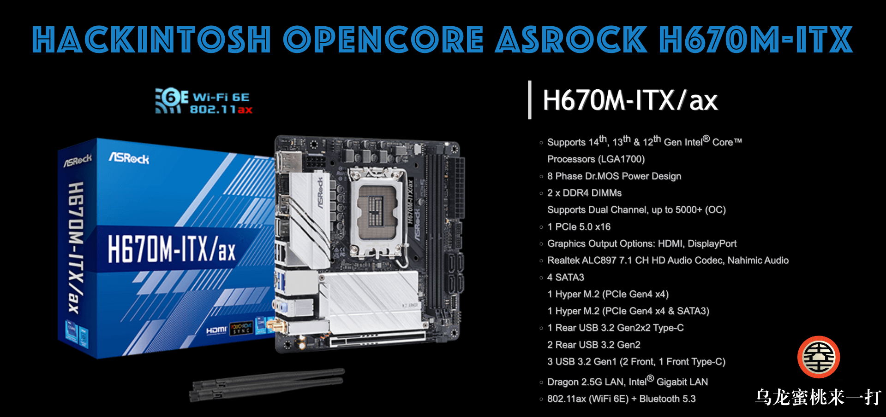

## 华擎 H670M-ITX/ax 黑苹果 OpenCore EFI



### [English](https://github.com/hackintosh-club/Asrock-H670M-ITX-OpenCore)

### OpenCore

[OpenCore 1.0.0](https://github.com/acidanthera/OpenCorePkg)

### 支持的系统版本

- macOS Monterey 12.x
- macOS Ventura  13.x
- macOS Sonoma   14.x 

### 硬件

- 主板: 华擎 H670M-ITX/ax
- Bios版本: 13.01（2023/04/13）
- CPU: Intel i5-12600kf
- 内存: 阿斯加特洛极T2 16GB*2 DDR4 3000MHz
- 固态硬盘: 1.西部数据 SN730 476G MacOS
- 固态硬盘: 2.海力士 PC401 238G Windows
- 独显: 蓝宝石 Radeon RX560 4GB 896SP
- 声卡: 瑞  昱 ALC897
- 网卡: 英特尔 L219-V
- 网卡: 瑞  昱 RTL8125 Gaming 2.5GbE
- 无线网卡: DW1560

### 注意事项

 - 安装成功后必须使用 [OCAuxiliaryTools](https://github.com/ic005k/OCAuxiliaryTools) 生成你自己的 SMBIOS
 - 如需使用没有小核心的CPU，必须取消勾选配置文件中Kernel--ProvideCurrentCpuinfo选项

### Bios Setup

```

	 |-- cfg Lock ：Disabled
	 |-- Intel Virtualization Technology ：Enabled
	 |-- XHCI Hand-off ：Enabled
	 |-- Above 4G Decoding ：Enabled
	 |-- VT-D ：Enabled
	 |-- C.A.M. (Clever Access Memory) ：Disabled
	 |-- Secure Boot ：Disabled
	 |-- Fast Boot ：Disabled
	 |-- Launch CSM  ：Disabled
	 
```


### 联系我们

 - QQ群: 23304408

